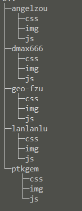
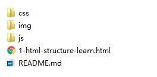

##IFE 任务1说明

> 任务地址：[http://ife.baidu.com/task/all](http://ife.baidu.com/task/all)

> 希望每个人都参与进来，共同进步

###一、任务1的目录说明
* 项目的初始目录如下所示：

	

* 一级目录为每个人对应的github名称，每个人直接在各自对应的github名称下面进行任务的学习。比如我的名称是**angelzou**，则我就在名为**angelzou**的文件夹中完成第一阶段的所有任务。

* 目前二级目录是我给大家的初始目录，包括**css**、**img**、**js**文件夹，这些文件夹用于存放对应的文件，使得开发过程中，整个目录结构分明。以及**README.md**文件，大家可以在**README.md**文件中说明自己任务情况等。       

	二级目录中的文件结构如下图所示：   
	
	
###二、团队伙伴们

* [小白](https://github.com/Geo-Fzu)
* [dmax](https://github.com/dmax666)
* [茶色](https://github.com/lanlanlu)
* [PT](https://github.com/PTKGEM)
* [我是小鬼](https://github.com/angelzou)

###三、demo地址

