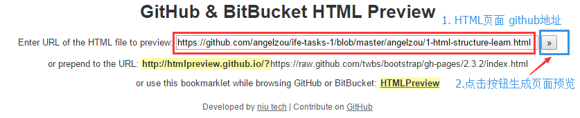

## IFE 任务1说明

> 任务地址：[http://ife.baidu.com/task/all](http://ife.baidu.com/task/all)

> 希望每个人都参与进来，共同进步

### 规范文档
请看百度FEX团队整理的规范文档：
[fex-team/styleguide](https://github.com/fex-team/styleguide/blob/master/project.md)

### 一、任务1的目录说明
* 项目的初始目录如下所示：

	

* 一级目录为每个人对应的github名称，每个人直接在各自对应的github名称下面进行任务的学习。比如我的名称是**angelzou**，则我就在名为**angelzou**的文件夹中完成第一阶段的所有任务。

* 目前二级目录是我给大家的初始目录，包括**css**、**img**、**js**文件夹，这些文件夹用于存放对应的文件，使得开发过程中，整个目录结构分明。以及**README.md**文件，大家可以在**README.md**文件中说明自己任务情况等。       

	二级目录中的文件结构如下图所示：   
	
	
### 二、团队伙伴们

* [小白](https://github.com/Geo-Fzu)
* [dmax](https://github.com/dmax666)
* [茶色](https://github.com/lanlanlu)
* [PT](https://github.com/PTKGEM)
* [我是小鬼](https://github.com/angelzou)

### 三、Github & BitBucket HTML Preview
暂时使用Github & BitBucket HTML Preview 生成demo页面预览，地址如下：   
[https://htmlpreview.github.io/](https://htmlpreview.github.io/)     
    

比如我输入： https://github.com/angelzou/ife-tasks-1/blob/master/angelzou/1-html-structure-learn.html  
生成的链接为： https://htmlpreview.github.io/?https://github.com/angelzou/ife-tasks-1/blob/master/angelzou/1-html-structure-learn.html    
然后在项目根目录的**index.html**文件中，将做好的demo加入其中。

### 四、demo地址
[IFE 第一阶段任务](https://htmlpreview.github.io/?https://github.com/angelzou/ife-tasks-1/blob/master/index.html)

### TODO
**任务地址：**[百度前端技术学院](http://ife.baidu.com/task/all)   

- [ ] 任务一，零基础HTML编码 
	- [x] 我是小鬼
	- [x] 小白
	- [x] 茶色
	- [ ] PT
	- [ ] dmax

- [ ] 任务二，零基础HTML及CSS编码 
	- [x] 我是小鬼
	- [x] 小白
	- [ ] 茶色
	- [ ] PT
	- [ ] dmax

- [ ] 任务三，三栏式布局
	- [x] 我是小鬼 （注意IE7下，display:inline-block问题；注意IE7下，浮动产生的双倍padding、margin问题）
	- [x] 小白
	- [ ] 茶色
	- [ ] PT
	- [ ] dmax

- [ ] 任务四，定位和居中问题
	- [x] 我是小鬼
	- [x] 小白
	- [ ] 茶色
	- [ ] PT
	- [ ] dmax

- [ ] 任务五，零基础HTML和CSS编码（二）
	- [x] 我是小鬼
	- [x] 小白
	- [ ] 茶色
	- [ ] PT
	- [ ] dmax

- [ ] 任务六，通过HTML及CSS模拟报纸排版
	- [x] 我是小鬼
	- [ ] 小白
	- [ ] 茶色
	- [ ] PT
	- [ ] dmax

- [ ] 任务七，实现常见的技术产品官网的页面架构
	- [ ] 我是小鬼
	- [ ] 小白
	- [ ] 茶色
	- [ ] PT
	- [ ] dmax

- [ ] 任务八，响应式网格（栅格化）布局
	- [x] 我是小鬼
	- [ ] 小白
	- [ ] 茶色
	- [ ] PT
	- [ ] dmax

- [ ] 任务九，使用HTML/CSS实现一个复杂页面
	- [ ] 我是小鬼
	- [ ] 小白
	- [ ] 茶色
	- [ ] PT
	- [ ] dmax

- [ ] 任务十，Flexbox布局练习
	- [x] 我是小鬼
	- [ ] 小白
	- [ ] 茶色
	- [ ] PT
	- [ ] dmax

- [ ] 任务十一，移动WEB页面布局实践
	- [ ] 我是小鬼
	- [ ] 小白
	- [ ] 茶色
	- [ ] PT
	- [ ] dmax

- [ ] 任务十二，学习CSS3新特性
	- [ ] 我是小鬼
	- [ ] 小白
	- [ ] 茶色
	- [ ] PT
	- [ ] dmax
